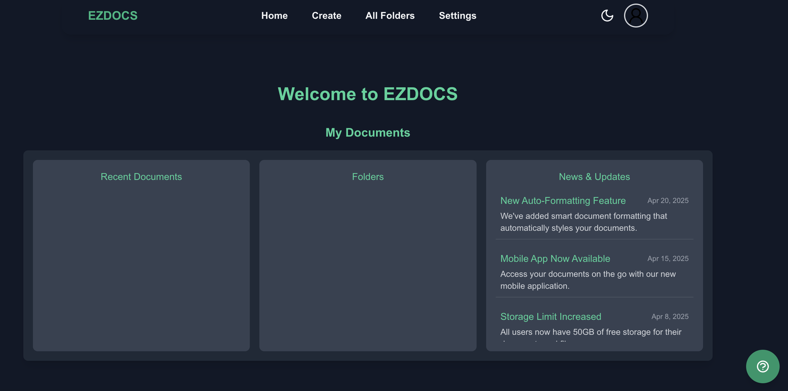

# About Me
Hello! My name is **Daniel Bauer**, and I am currently a student pursuing a Bachelor of Science in Computer Science at the University of Saint Thomas. I graduated from Cretin-Derham Hall in 2021 and will graduate from St. Thomas in the summer of 2025. Some of my interests in the computer science field include IT and Cybersecurity. I am passionate about helping people use software and technology by creating easy-to-use interfaces and incorporating accessible features for everyone. My dream is to create a product that will incorporate these interests and help people succeed with learning new technologies.

---

# Skills
- **Programming Languages**: Python, Java, JavaScript, HTML, CSS
- **UI/UX Design**: Figma, Human-Computer Interaction, Accessible Web Design
- **IT**: Troubleshooting, Operating Systems, Asset Management, Networking Basics
- **Cybersecurity**: Secure Coding, Risk Management
- **Other**: Problem Solving, Communication, Team Collaboration, Leadership, Adapting to New Technologies

---

# Projects
## EZDocs
**Description**:  
An AI-assisted technical documentation creator website for beginners. EZDocs offers pre-created templates to guide users, allows them to generate new templates using AI, and checks users' work by providing feedback and suggestions. I collaborated on this project with Anton Lacson and Alex Cole.

**Figure**:  

**Keywords**: AI, Documentation, Web Development, User Assistance

**My Contributions**:
- Frontend design (UI/UX)
- Provided pre-created templates for users

# Resume
[View My Resume](./DanielBauer2024.pdf)
